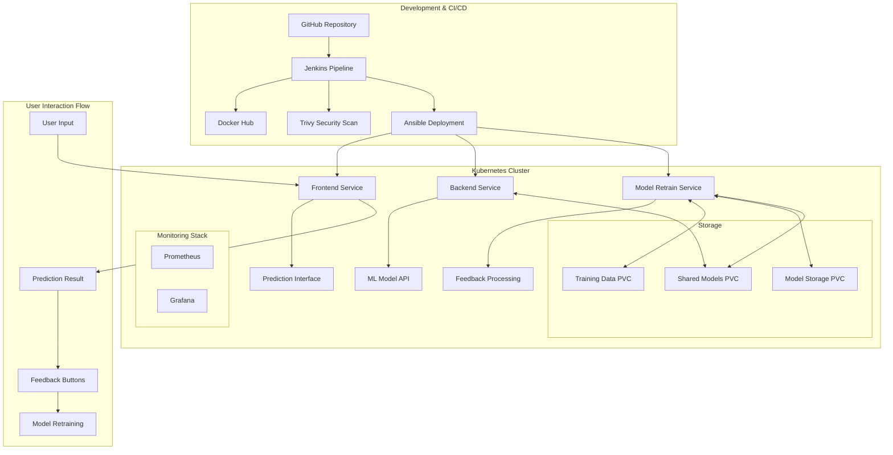

# 🏥 Liver Disease Prediction MLOps Platform

## 📋 Project Overview

A complete **MLOps platform** for liver disease prediction featuring automated CI/CD pipelines, model retraining with user feedback, comprehensive monitoring, and Kubernetes-based deployment. This project demonstrates enterprise-grade machine learning operations with automated model lifecycle management.

## 🏗️ Architecture Overview



## 🛠️ Technology Stack

| **Category** | **Technology** | **Purpose** |
|--------------|---------------|-------------|
| **Container Orchestration** | Kubernetes, Minikube | Container management and orchestration |
| **CI/CD** | Jenkins, Ansible | Automated build, test, and deployment |
| **Container Runtime** | Docker | Application containerization |
| **Security Scanning** | Trivy | Container vulnerability scanning |
| **Frontend** | Flask, HTML/CSS/JavaScript | User interface for predictions |
| **Backend API** | FastAPI, Python | REST API for ML predictions |
| **Machine Learning** | Scikit-learn, NumPy, Pandas | Model training and inference |
| **Model Retraining** | Flask, Threading | Automated model retraining service |
| **Monitoring** | Prometheus, Grafana | Application and infrastructure monitoring |
| **Storage** | Kubernetes PVC | Persistent data and model storage |
| **Service Mesh** | Kubernetes Services | Inter-service communication |
| **RBAC** | Kubernetes RBAC | Role-based access control |
| **Registry** | Docker Hub | Container image storage |

## ✨ Key Features

### 🤖 **Automated ML Pipeline**
- **Logistic Regression** model for liver disease prediction
- **Feature engineering** with PCA and outlier handling
- **L1 regularization** for feature selection
- **Real-time predictions** via REST API

### 🔄 **Model Retraining System**
- **User feedback collection** (Correct/Wrong/Don't Know)
- **Automatic background retraining** when feedback is provided
- **Incremental learning** combining original + feedback data
- **Dynamic model updates** without service restart

### 🚀 **DevOps & MLOps**
- **Jenkins CI/CD pipeline** with automated builds
- **Ansible-based deployment** to Kubernetes
- **Security scanning** with Trivy
- **Email notifications** for pipeline status
- **Automated rollbacks** on deployment failures

### 📊 **Monitoring & Observability**
- **Prometheus metrics** collection
- **Grafana dashboards** for visualization
- **Health checks** for all services
- **Comprehensive logging** and alerting

### 🔐 **Security & Governance**
- **RBAC implementation** with multiple roles
- **Service accounts** for secure pod execution
- **Network policies** for service isolation
- **Persistent volume security**

## 🚀 Quick Start Guide

### Prerequisites

Ensure you have the following installed on your machine:

```bash
# Required tools
- Docker
- Kubernetes (Minikube recommended)
- kubectl
- Git
- Jenkins
- Ansible
```

### 🔐 Secret Files Setup

Before deploying, copy the required Kubernetes configuration and certificate files from the `important_docs` folder:

```bash
# 1. Copy Kubernetes config file to your .kube directory
cp important_docs/kube-config.txt ~/.kube/config

# 2. Copy Minikube CA certificate
cp important_docs/minikube-ca.txt ~/.minikube/ca.crt

# 3. Copy Minikube client certificate
cp important_docs/minikube-client-cert.txt ~/.minikube/profiles/minikube/client.crt

# 4. Copy Minikube client key
cp important_docs/minikube-client-key.txt ~/.minikube/profiles/minikube/client.key
```

### ⚙️ Jenkins Variables Configuration

**Important**: Update the following variables in the `Jenkinsfile` to match your environment:

| **Variable** | **Current Value** | **Description** | **Required Change** |
|--------------|-------------------|-----------------|---------------------|
| `DOCKER_IMAGE_FRONTEND` | `prabhav49/frontend-app` | Docker Hub frontend image | Replace `prabhav49` with **your Docker Hub username** |
| `DOCKER_IMAGE_BACKEND` | `prabhav49/backend-app` | Docker Hub backend image | Replace `prabhav49` with **your Docker Hub username** |
| `DOCKER_IMAGE_RETRAIN` | `prabhav49/model-retrain-app` | Docker Hub retrain image | Replace `prabhav49` with **your Docker Hub username** |
| `Git Repository URL` | `https://github.com/Prabhav49/LiverCareApp.git` | Source code repository | Replace with **your GitHub repository URL** |
| `Email Address` | `iam49smith@gmail.com` | Notification email | Replace with **your email address** |
| `GIT_CREDENTIALS` | `github-cred` | Jenkins credential ID | Update to **your GitHub credentials ID** |

**Jenkins Credentials Required:**
- `github-cred` - GitHub repository access
- `docker-hub-credentials` - Docker Hub username/password
- `kube-config` - Kubernetes config file (from important_docs)
- `minikube-client-cert` - Client certificate file
- `minikube-client-key` - Client key file  
- `minikube-ca` - CA certificate file

### 1. **Environment Setup**

```bash
# Clone the repository
git clone <your-repo-url>
cd SPE_Project

# Start Minikube
minikube start --memory=8192 --cpus=4

# Enable required addons
minikube addons enable ingress
minikube addons enable metrics-server
```

### 2. **Jenkins Setup**

```bash
# Create Jenkins service account
kubectl apply -f jenkins-account-service/

# Get Jenkins service account token
kubectl describe secret $(kubectl get secrets | grep jenkins | cut -f1 -d ' ') | grep -E '^token' | cut -f2 -d':' | tr -d " "

# Configure Jenkins with:
# - Kubernetes plugin
# - Docker pipeline plugin
# - Ansible plugin
# - Email extension plugin
```

### 3. **Configure Jenkins Pipeline**

1. **Create new Pipeline job** in Jenkins
2. **Configure SCM**: Point to your GitHub repository
3. **Set Pipeline script path**: `Jenkinsfile`
4. **Configure credentials**:
   - Docker Hub credentials (`docker-hub-credentials`)
   - Email SMTP settings
   - Kubernetes config

### 4. **Deploy via Jenkins**

```bash
# Trigger Jenkins pipeline (automatic on GitHub push)
# Or manually trigger from Jenkins UI

# Monitor deployment
kubectl get pods -n mlops-project
kubectl get services -n mlops-project
```

### 5. **Access Services**

```bash
# Get service URLs
minikube service frontend-service -n mlops-project --url
minikube service prometheus-service -n mlops-project --url
minikube service grafana-service -n mlops-project --url

# Or use port forwarding
kubectl port-forward svc/frontend-service 8080:5000 -n mlops-project
```

## 📱 Usage Workflow

### **Making Predictions**

1. **Access Frontend**: Navigate to frontend URL
2. **Enter Patient Data**: Fill in the medical parameters
3. **Get Prediction**: Click "Predict" to get liver disease probability
4. **Provide Feedback**: Use feedback buttons to improve the model

### **Feedback Options**

- ✅ **Prediction is Correct**: Reinforces model accuracy
- ❌ **Prediction is Wrong**: Triggers model retraining with corrected label
- ❓ **Don't Know**: Stores data without immediate retraining

### **Model Retraining Process**

```bash
# Automatic process triggered by feedback:
1. User provides feedback → Frontend sends to Backend
2. Backend forwards to Model Retrain Service
3. Feedback data stored in persistent volume
4. Background retraining combines original + feedback data
5. New model saved to shared volume
6. Backend automatically loads updated model
```

## 🔧 Manual Deployment (Alternative)

If you prefer manual deployment without Jenkins:

```bash
# Build all Docker images
docker build -t frontend-app ./frontend/
docker build -t backend-app ./backend/
docker build -t model-retrain-app ./model-retrain/

# Deploy to Kubernetes
kubectl apply -f k8s-manifests/rbac/
kubectl apply -f k8s-manifests/
kubectl apply -f k8s-manifests/monitoring/

# Wait for deployments
kubectl rollout status deployment/frontend-deployment -n mlops-project
kubectl rollout status deployment/backend-deployment -n mlops-project
kubectl rollout status deployment/model-retrain-deployment -n mlops-project
```

## 📊 Monitoring & Verification

### **Check System Health**

```bash
# Run monitoring script
./monitor-retraining.sh

# Check individual services
kubectl get pods -n mlops-project
kubectl logs -f deployment/model-retrain-deployment -n mlops-project
```

### **Verify Model Retraining**

```bash
# Run comprehensive demonstration
./demo-retraining.sh

# This script will:
# 1. Show initial model state
# 2. Guide you through feedback submission
# 3. Monitor retraining process
# 4. Verify model updates with proof
```

### **Access Monitoring Dashboards**

```bash
# Prometheus: Monitor system metrics
# Grafana: Visualize performance dashboards (admin/admin)
# Check service URLs with: minikube service list -n mlops-project
```

## 🔍 API Documentation

### **Frontend Service** (`/`)
- `GET /` - Main prediction interface
- `POST /feedback` - Submit user feedback

### **Backend Service** (`/api`)
- `POST /predict` - Get liver disease prediction
- `GET /health` - Service health check

### **Model Retrain Service** (`/retrain`)
- `POST /add_feedback_data` - Process feedback and trigger retraining
- `GET /health` - Health status with retraining info
- `GET /retrain_status` - Detailed retraining status

## 🛡️ Security Features

### **RBAC Roles**
- **Admin**: Full cluster access
- **Developer**: Development and deployment permissions  
- **ML Engineer**: Model and data management access
- **Viewer**: Read-only monitoring access

### **Security Scanning**
- **Trivy integration** in Jenkins pipeline
- **Vulnerability scanning** for all Docker images
- **Security gate** prevents deployment of vulnerable images

## 🚨 Troubleshooting

### **Common Issues & Solutions**

```bash
# Pipeline fails
kubectl logs -f <jenkins-pod> -n jenkins

# Pods not starting
kubectl describe pod <pod-name> -n mlops-project
kubectl get events -n mlops-project

# Persistent volumes issues
kubectl get pv,pvc -n mlops-project
kubectl describe pvc <pvc-name> -n mlops-project

# Model retraining not working
kubectl exec -it deployment/model-retrain-deployment -n mlops-project -- ls -la /data/
kubectl logs deployment/model-retrain-deployment -n mlops-project | grep -i error
```

### **Service Debugging**

```bash
# Check service connectivity
kubectl exec -it deployment/frontend-deployment -n mlops-project -- nslookup backend-service
kubectl exec -it deployment/backend-deployment -n mlops-project -- curl http://model-retrain-service:8080/health

# Verify persistent volume mounts
kubectl exec -it deployment/model-retrain-deployment -n mlops-project -- df -h
```

## 📈 Performance Optimization

### **Resource Management**
- **HPA (Horizontal Pod Autoscaler)** configured for frontend and backend
- **Resource limits** set for all containers
- **Persistent volume** optimization for data access

### **Scaling Recommendations**
```bash
# Monitor resource usage
kubectl top pods -n mlops-project
kubectl top nodes

# Scale deployments
kubectl scale deployment frontend-deployment --replicas=3 -n mlops-project
```

## 🤝 Contributing

1. **Fork the repository**
2. **Create feature branch**: `git checkout -b feature/new-feature`
3. **Make changes** and test thoroughly
4. **Run security scans**: Ensure Trivy passes
5. **Submit pull request** with detailed description

## 🙏 Acknowledgments

- **Liver Patient Dataset** from UCI ML Repository
- **Kubernetes community** for excellent documentation
- **Jenkins and Ansible** communities for automation tools

## 📞 Support

For issues and questions:
- **Create GitHub Issues** for bugs and feature requests
- **Check logs** using provided monitoring scripts
- **Review troubleshooting section** for common problems

---

**🎯 Project Status**: Production Ready ✅  
**🔄 Last Updated**: May 28, 2025  
**📊 Test Coverage**: Frontend, Backend, ML Pipeline  
**🛡️ Security**: RBAC + Trivy Scanning  
**📈 Monitoring**: Prometheus + Grafana  
**🤖 MLOps**: Automated CI/CD + Model Retraining
